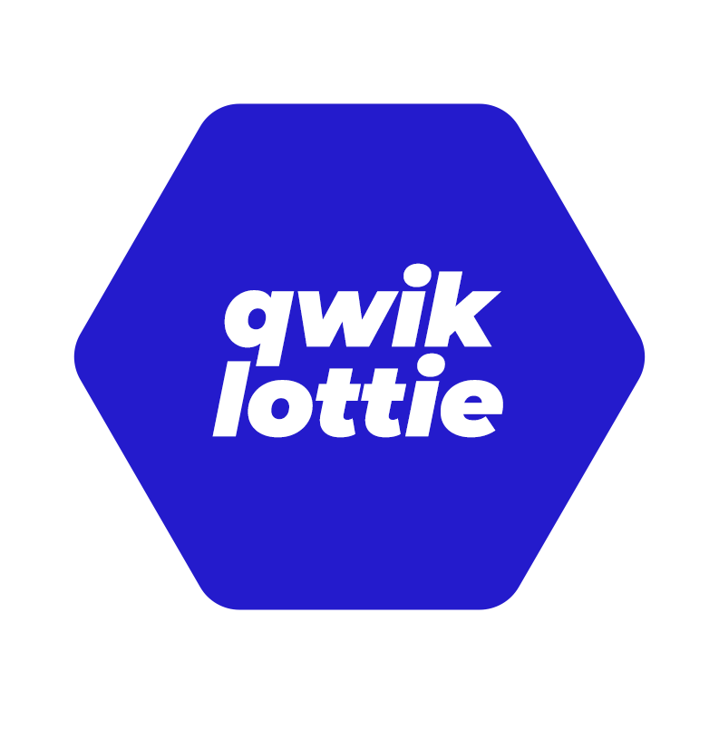
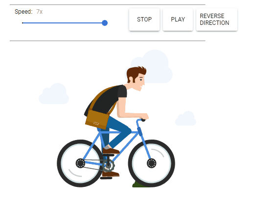
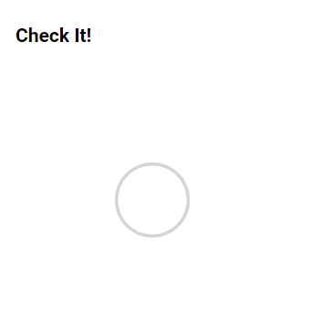
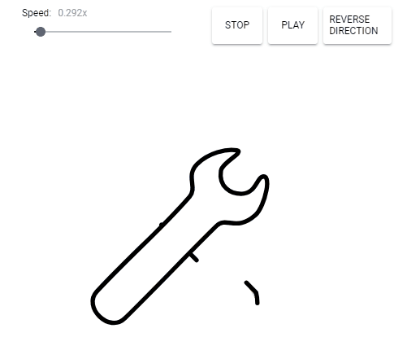

<p align="center">
  <br>
  
  <br>
</p>

<h1 align='center'>Qwik Lottie</h1>

<div align='center'>
Lottie Animation Component for <a href='https://github.com/BuilderIO/qwik'>Qwik</a>.
<br><br>
<a href='http://badge.fury.io/js/qwik-lottie'>

</a>
</div>

<details>
<summary>Table of Contents</summary>

- [Wapper of bodymovin.js](#wapper-of-bodymovinjs)
- [Demo](#demo)
- [Why Lottie?](#why-lottie)
    - [Flexible After Effects features](#flexible-after-effects-features)
    - [Manipulate your animation any way you like](#manipulate-your-animation-any-way-you-like)
    - [Small file sizes](#small-file-sizes)
- [Installation](#installation)
- [Usage](#usage)
- [Lottie Files](#lottie-files)
- [Configuration](#configuration)
- [Related Projects](#related-projects)
- [Contributing](#contributing)
- [License](#license)
- [Netlify](#netlify)
  - [Local development](#local-development)
  - [Deployments](#deployments)
    - [Deploying via Git](#deploying-via-git)
    - [Deploying manually via the CLI](#deploying-manually-via-the-cli)

</details>

## Wapper of bodymovin.js

[bodymovin](https://github.com/bodymovin/bodymovin) is [Adobe After Effects](http://www.adobe.com/products/aftereffects.html) plugin for exporting animations as JSON, also it provide bodymovin.js for vender them as svg/canvas/html.

## Demo

<p align="center" class="rich-diff-level-zero">
  
  
  
  
</p>

## Why Lottie?

#### Flexible After Effects features

We currently support solids, shape layers, masks, alpha mattes, trim paths, and dash patterns. And we’ll be adding new features on a regular basis.

#### Manipulate your animation any way you like

You can go forward, backward, and most importantly you can program your animation to respond to any interaction.

#### Small file sizes

Bundle vector animations within your app without having to worry about multiple dimensions or large file sizes. Alternatively, you can decouple animation files from your app’s code entirely by loading them from a JSON API.

[Learn more](http://airbnb.design/introducing-lottie/) › http://airbnb.design/lottie/

Looking for lottie files › https://www.lottiefiles.com/

## Installation

Install through npm:

```
npm install --save qwik-lottie
```

## Usage

```js
import { component$, useStore } from '@builder.io/qwik';
import { QwikLottie } from 'qwik-lottie';

export default component$(() => {
  const store = useStore({
    options: {
      path: 'https://assets7.lottiefiles.com/packages/lf20_M6jA5UNDHa.json',
    },
  });
  return (
    <>
      <div>
        <QwikLottie options={store.options} />
      </div>
    </>
  );
});

```

## Lottie Files

Get free json files from [LottieFiles](https://lottiefiles.com/featured).

## Configuration

You can pass a configuration object through property:

- animationData: an Object with the exported animation data.
- path: the relative path to the animation object. (animationData and path are mutually exclusive)
- loop: true / false / number
- autoplay: true / false it will start playing as soon as it is ready
- name: animation name for future reference
- renderer: 'svg' / 'canvas' / 'html' to set the renderer
- container: the dom element on which to render the animation

More information on [Bodymoving Documentation](https://github.com/bodymovin/bodymovin)

## Related Projects

- [Bodymovin](https://github.com/bodymovin/bodymovin) qwik-lottie is a wrapper of bodymovin
- [Angular Lottie](https://github.com/chenqingspring/ng-lottie) angular implementation
- [React Lottie](https://github.com/chenqingspring/react-lottie) react implementation
- [React Native Lottie](https://github.com/airbnb/lottie-react-native) react native implementation by airbnb
- [IOS Lottie](https://github.com/airbnb/lottie-ios) ios implementation by airbnb
- [Android Lottie](https://github.com/airbnb/lottie-android) android implementation by airbnb

## Contributing

Found an awesome package, article, blog, video etc.? Send me a pull request! Just follow the [guidelines](CONTRIBUTING.md). Thank you!.

## License

MIT

## Netlify

This starter site is configured to deploy to [Netlify Edge Functions](https://www.netlify.com/products/edge/), which means it will be rendered at an edge location near to your users.

### Local development

The [Netlify CLI](https://docs.netlify.com/cli/get-started/) can be used to preview a production build locally. To do so: First build your site, then to start a local server, run:

1. install Netlify CLI globally `npm i -g netlify-cli`
2. Build your site both ssr and client `npm run build`.
3. Start a local server with `npm run serve`.
   In this project, `npm run serve` uses the `netlify dev` command to spin up a server that can handle Netlify's Edge Functions locally.
4. Visit [http://localhost:8888/](http://localhost:8888/) to check out your site.

### Deployments

You can [deploy your site to Netlify](https://docs.netlify.com/site-deploys/create-deploys/) either via a Git provider integration or through the Netlify CLI. This starter site includes a `netlify.toml` file to configure your build for deployment.

#### Deploying via Git

Once your site has been pushed to your Git provider, you can either link it [in the Netlify UI](https://app.netlify.com/start) or use the CLI. To link your site to a Git provider from the Netlify CLI, run the command:

```shell
netlify link
```

This sets up [continuous deployment](https://docs.netlify.com/site-deploys/create-deploys/#deploy-with-git) for your site's repo. Whenever you push new commits to your repo, Netlify starts the build process..

#### Deploying manually via the CLI

If you wish to deploy from the CLI rather than using Git, you can use the command:

```shell
netlify deploy --build
```

You must use the `--build` flag whenever you deploy. This ensures that the Edge Functions that this starter site relies on are generated and available when you deploy your site.

Add `--prod` flag to deploy to production.
